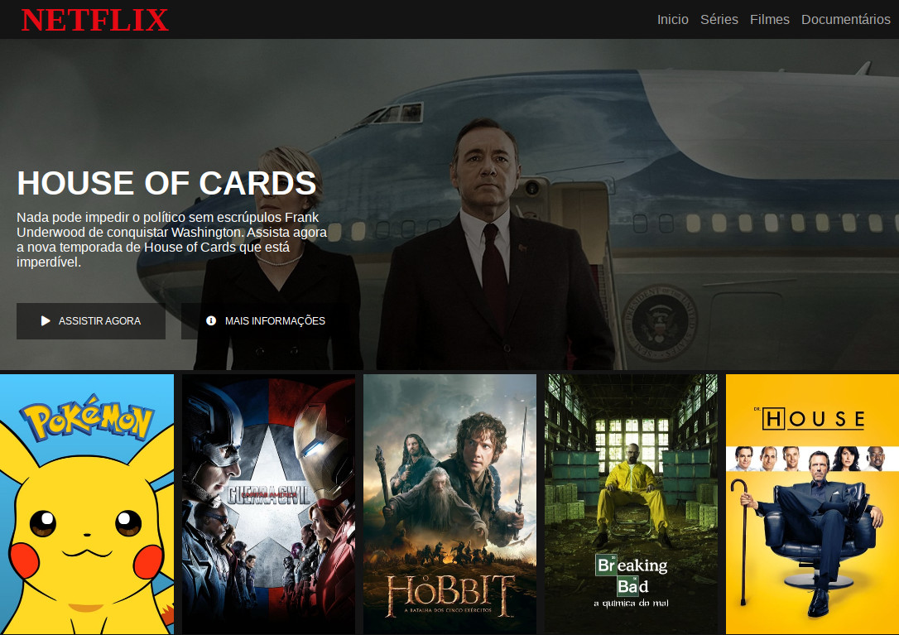

# dio-netflix-clone

A Netflix clone based on **Digital Innovation One** classes.

Author: [Francis Rodrigues](https://github.com/francisrod01)

> Initial code by: [felipeAguiarCode/netflix-clone](https://github.com/felipeaguiarcode/netflix-clone)

## Going further

The next steps are:

- [ ] Importing Web fonts
- [ ] Adding a modal for movie description
- [ ] Adding a search input
- [ ] Filtering by a dynamic movies list

## License

MIT
